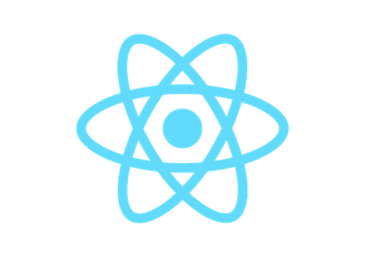

# React minimal starter project

This is a starter for a React project. It's as minimal as it gets and uses Webpack and Babel



## Use

1. Clone this project

1. Run `npm install`:

   ```bash
   npm install
   ```

1. Run `npm start`:

   ```bash
   npm start
   ```

   This will launch a web server with HMR at **http://localhost:8080**.

1. Your React is at `src/index.js`, edit away :)


Also check Robin's tutorial, from which the above tutorial was inspired

> https://www.robinwieruch.de/minimal-react-webpack-babel-setup/#react-with-webpack